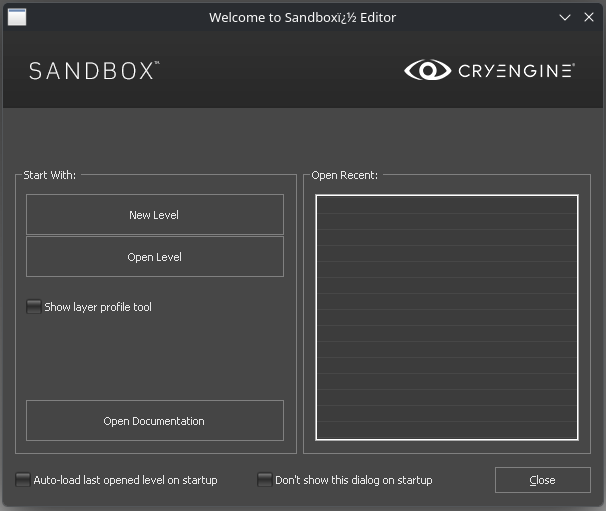

# Kingdome Come Deliverance 2 - modding guide

This is an unofficial modding guide for Kingdome Come Deliverance 2, 
which contains in-depth resources and information on technical aspects of the game and its development.

## Getting started
To get started, you have to download the [official modding tools](steam://open/games/details/2429020) via steam.
For further information check out [Modding Kingdom Come: Deliverance 2 - Wiki](https://warhorse.youtrack.cloud/articles/KM-A-55/The-Modding-Tools).

The modding tools contain two important tools: 
- The sandbox editor of the cryengine (https://www.cryengine.com/)
  - The editor allows us to modify the game assets and create new levels, which is very useful for modding purposes
  - For lua coding, its possible to reload the source, instead of loading the full game completely every time one wants to test some technical aspect
- The development version of the game, which allows us to do a lot of interesting things, but most importantly, it allows us to:
  - "loads loose files from Data/ folder and mods/ folders (published games loads only files in PAKs and loose .cfg files)" - this means we dont have to repack the assets every time we want to test something
  - "It runs an internal web server that you can connect to, which has several major debug features"
  - "It contains all debug commands and functions (as a side effect it runs slower)"

### Workspace Setup
After you've downloaded the game and the modding tools, your steam library also contains two application entries.
If you start the modding tools right after downloading them, 
you'll get a bunch of errors and the editor or game will crash 
- thats because you need to setup your "workspace", because the modding tools dont contain all the files required to run (base game: ~90gb, editor: only ~15gb).

#### Windows
There is a dedicated tool for the setup on windows, check out https://warhorse.youtrack.cloud/articles/KM-A-55/The-Modding-Tools#workspace-setup for further information.

#### Linux
If you dont want to install microsoft .net, which is a total pain within the correct wine / proton prefix, 
one can simply copy and paste all .PAK-files from /Data, /Data/Levels/ and Localization/ into the corresponding directory within the modding tools,
or simply link them (via symbolic links).

A working folder structure, using linux, looks like this:

| Modding tools paths                   | Absolute linux file system path                                                                     |
|---------------------------------------|-----------------------------------------------------------------------------------------------------|
| KCD2Mod/data/Animations.pak           | /mnt/data/SteamLibrary/steamapps/common/KingdomComeDeliverance2/Data/Animations.pak                 |
| KCD2Mod/data/Characters.pak           | /mnt/linux_data/SteamLibrary/steamapps/common/KingdomComeDeliverance2/Data/Characters.pak           |
| KCD2Mod/data/Cinematics.pak           | /mnt/linux_data/SteamLibrary/steamapps/common/KingdomComeDeliverance2/Data/Cinematics.pak           |
| KCD2Mod/data/Developer.pak            |                                                                                                     |
| KCD2Mod/data/Facials                  | /mnt/linux_data/SteamLibrary/steamapps/common/KingdomComeDeliverance2/Data/Facials                  |
| KCD2Mod/data/GeomCaches.pak           | /mnt/linux_data/SteamLibrary/steamapps/common/KingdomComeDeliverance2/Data/GeomCaches.pak           |
| KCD2Mod/data/Heads.pak                | /mnt/linux_data/SteamLibrary/steamapps/common/KingdomComeDeliverance2/Data/Heads.pak                |
| KCD2Mod/data/hlod_prefab.pak          | /mnt/linux_data/SteamLibrary/steamapps/common/KingdomComeDeliverance2/Data/hlod_prefab.pak          |
| KCD2Mod/data/IPL_Characters-part0.pak | /mnt/linux_data/SteamLibrary/steamapps/common/KingdomComeDeliverance2/Data/IPL_Characters-part0.pak |
| KCD2Mod/data/IPL_Characters-part1.pak | /mnt/linux_data/SteamLibrary/steamapps/common/KingdomComeDeliverance2/Data/IPL_Characters-part1.pak |
| KCD2Mod/data/IPL_Characters-part2.pak | /mnt/linux_data/SteamLibrary/steamapps/common/KingdomComeDeliverance2/Data/IPL_Characters-part2.pak |
| KCD2Mod/data/IPL_Characters-part3.pak | /mnt/linux_data/SteamLibrary/steamapps/common/KingdomComeDeliverance2/Data/IPL_Characters-part3.pak |
| KCD2Mod/data/IPL_GameData.pak         | /mnt/linux_data/SteamLibrary/steamapps/common/KingdomComeDeliverance2/Data/IPL_GameData.pak         |
| KCD2Mod/data/IPL_GeomCaches.pak       | /mnt/linux_data/SteamLibrary/steamapps/common/KingdomComeDeliverance2/Data/IPL_GeomCaches.pak       |
| KCD2Mod/data/IPL_Heads-part0.pak      | /mnt/linux_data/SteamLibrary/steamapps/common/KingdomComeDeliverance2/Data/IPL_Heads-part0.pak      |
| KCD2Mod/data/IPL_Heads-part1.pak      | /mnt/linux_data/SteamLibrary/steamapps/common/KingdomComeDeliverance2/Data/IPL_Heads-part1.pak      |
| KCD2Mod/data/IPL_Objects-part0.pak    | /mnt/linux_data/SteamLibrary/steamapps/common/KingdomComeDeliverance2/Data/IPL_Objects-part0.pak    |
| KCD2Mod/data/IPL_Objects-part1.pak    | /mnt/linux_data/SteamLibrary/steamapps/common/KingdomComeDeliverance2/Data/IPL_Objects-part1.pak    |
| KCD2Mod/data/IPL_Objects-part2.pak    | /mnt/linux_data/SteamLibrary/steamapps/common/KingdomComeDeliverance2/Data/IPL_Objects-part2.pak    |
| KCD2Mod/data/IPL_Objects-part3.pak    | /mnt/linux_data/SteamLibrary/steamapps/common/KingdomComeDeliverance2/Data/IPL_Objects-part3.pak    |
| KCD2Mod/data/IPL_Objects-part4.pak    | /mnt/linux_data/SteamLibrary/steamapps/common/KingdomComeDeliverance2/Data/IPL_Objects-part4.pak    |
| KCD2Mod/data/IPL_Objects-part5.pak    | /mnt/linux_data/SteamLibrary/steamapps/common/KingdomComeDeliverance2/Data/IPL_Objects-part5.pak    |
| KCD2Mod/data/IPL_Textures-part0.pak   | /mnt/linux_data/SteamLibrary/steamapps/common/KingdomComeDeliverance2/Data/IPL_Textures-part0.pak   |
| KCD2Mod/data/IPL_Textures-part1.pak   | /mnt/linux_data/SteamLibrary/steamapps/common/KingdomComeDeliverance2/Data/IPL_Textures-part1.pak   |
| KCD2Mod/data/IPL_Textures-part2.pak   | /mnt/linux_data/SteamLibrary/steamapps/common/KingdomComeDeliverance2/Data/IPL_Textures-part2.pak   |
| KCD2Mod/data/IPL_Videos-part0.pak     | /mnt/linux_data/SteamLibrary/steamapps/common/KingdomComeDeliverance2/Data/IPL_Videos-part0.pak     |
| KCD2Mod/data/IPL_Videos-part1.pak     | /mnt/linux_data/SteamLibrary/steamapps/common/KingdomComeDeliverance2/Data/IPL_Videos-part1.pak     |
| KCD2Mod/data/IPL_Videos-part2.pak     | /mnt/linux_data/SteamLibrary/steamapps/common/KingdomComeDeliverance2/Data/IPL_Videos-part2.pak     |
| KCD2Mod/data/Levels                   |                                                                                                     |
| KCD2Mod/data/libs                     |                                                                                                     |
| KCD2Mod/data/Music.pak                | /mnt/linux_data/SteamLibrary/steamapps/common/KingdomComeDeliverance2/Data/Music.pak                |
| KCD2Mod/data/objects                  |                                                                                                     |
| KCD2Mod/data/Objects-part0.pak        | /mnt/linux_data/SteamLibrary/steamapps/common/KingdomComeDeliverance2/Data/Objects-part0.pak        |
| KCD2Mod/data/Objects-part1.pak        | /mnt/linux_data/SteamLibrary/steamapps/common/KingdomComeDeliverance2/Data/Objects-part1.pak        |
| KCD2Mod/data/Objects-part2.pak        | /mnt/linux_data/SteamLibrary/steamapps/common/KingdomComeDeliverance2/Data/Objects-part2.pak        |
| KCD2Mod/data/Objects-part3.pak        | /mnt/linux_data/SteamLibrary/steamapps/common/KingdomComeDeliverance2/Data/Objects-part3.pak        |
| KCD2Mod/data/pak.cfg                  |                                                                                                     |
| KCD2Mod/data/Quests/                  |                                                                                                     |
| KCD2Mod/data/Scripts.pak              | /mnt/linux_data/SteamLibrary/steamapps/common/KingdomComeDeliverance2/Data/Scripts.pak              |
| KCD2Mod/data/Sounds.pak               | /mnt/linux_data/SteamLibrary/steamapps/common/KingdomComeDeliverance2/Data/Sounds.pak               |
| KCD2Mod/data/Tables.pak               | /mnt/linux_data/SteamLibrary/steamapps/common/KingdomComeDeliverance2/Data/Tables.pak               |
| KCD2Mod/data/Textures-part0.pak       | /mnt/linux_data/SteamLibrary/steamapps/common/KingdomComeDeliverance2/Data/Textures-part0.pak       |
| KCD2Mod/data/Textures-part1.pak       | /mnt/linux_data/SteamLibrary/steamapps/common/KingdomComeDeliverance2/Data/Textures-part1.pak       |
| KCD2Mod/data/Videos-part0.pak         | /mnt/linux_data/SteamLibrary/steamapps/common/KingdomComeDeliverance2/Data/Videos-part0.pak         |
| KCD2Mod/data/Videos-part1.pak         | /mnt/linux_data/SteamLibrary/steamapps/common/KingdomComeDeliverance2/Data/Videos-part1.pak         |
| KCD2Mod/data/Videos-part2.pak         | /mnt/linux_data/SteamLibrary/steamapps/common/KingdomComeDeliverance2/Data/Videos-part2.pak         |
| KCD2Mod/data/Videos-part3.pak         | /mnt/linux_data/SteamLibrary/steamapps/common/KingdomComeDeliverance2/Data/Videos-part3.pak         |
| KCD2Mod/data/Videos-part4.pak         | /mnt/linux_data/SteamLibrary/steamapps/common/KingdomComeDeliverance2/Data/Videos-part4.pak         |
| KCD2Mod/data/Videos-part5.pak         | /mnt/linux_data/SteamLibrary/steamapps/common/KingdomComeDeliverance2/Data/Videos-part5.pak         |

After that, you should be able to start the development version of the game or the sandbox editor:


## Creating a new mod
See: https://warhorse.youtrack.cloud/articles/KM-A-55/The-Modding-Tools#workspace-setup for detailed instructions on how to create a new mod.

## How To 

### Extract a .pak - file
Just use any archive manager, like ark or 7zip.

### Create a .pak - file
A *.pak-file can be created any compression software which supports the selection of a compression method and level.
I have created *.pak-files by using Ark, using deflate as the compression method on the lowest compression level.

### Create a new console command
If you want to create a new console command, execute the following steps:

1. Create a new lua function, or reuse an existing one, like:
```
function mySuperTest()
    Game.SendInfoText("mySuperTest enabled!", false)
end
```

2. Create a console commande: 
 - The first parameter is the name of the new console command
 - The second parameter is the name of the lua function, dont forget the brackets!
 - The third parameter is a description of the command
```
System.AddCCommand("mySuperNewConsoleCommand", "mySuperTest()", "Activate or deactivate the architect mod.")
```

### Bind a key to a lua function
If you want to execute a lua function after a user pressed a key, you can use the bind command.
Note: We're calling a command, which is outside of the lua context, so we need to prepend the command with the #-character. (You can also call lua functions from the console by prepending them with a #)
```
System.ExecuteCommand("bind mwheel_up #mySuperTest()")
```

### Bind a key to a console command
If you want to execute a conole command after a user pressed a key, you can also use the bind command.
Note: We are calling the bind command from the lua context, so we need to use System.ExecuteCommand - 
so when the user presses f5, we're not calling the lua function directly, but the console command created within the previous example.

```
System.ExecuteCommand("bind 'f5' mySuperNewConsoleCommand")
```


## Porting mods from KCD1 to KCD2

### Code changes
- The function "vecScale" is now called "VectorUtils.Scale"
- The functions "MakeUsable", "AddHeavyObjectProperty", "AddInteractLargeObjectProperty", "SetupCollisionFiltering" are now part of the EntityCommon-Table, 
  so you have to prefix them with "EntityCommon.", like "EntityCommon.MakeUsable(entity)"

## Tips
- (Linux) If you want to locate all files with a specific extension, for example, all cgf-files, you can use "find . -type f -iname '*cgf'" in the terminal.
- If you want to reload the source code, you can use the "Reload Source" button in the editor.

## Further reading: 
- WarHorse guide for creating mods: https://warhorse.youtrack.cloud/articles/KM-A-55/The-Modding-Tools
- CryTek API for entities: https://www.cryengine.com/docs/static/engines/cryengine-5/categories/23756813/pages/23306601
- List of Key Names: https://www.cryengine.com/docs/static/engines/cryengine-5/categories/23756813/pages/23306384
